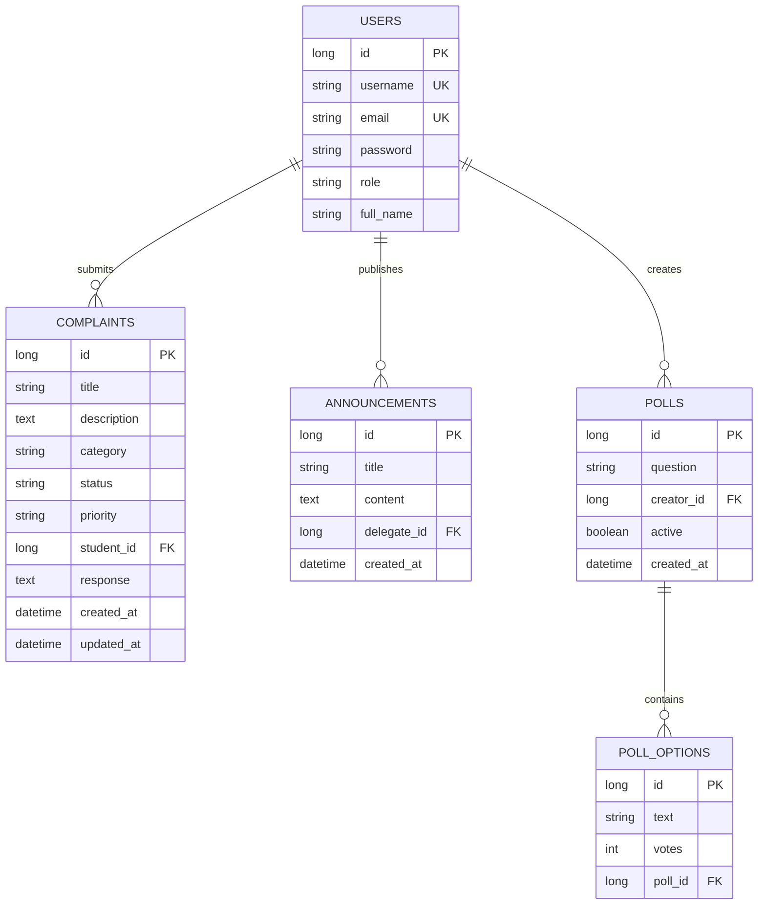

# UniGov - Database ERD

```mermaid
erDiagram
    USERS ||--o{ COMPLAINTS : submits
    USERS ||--o{ ANNOUNCEMENTS : publishes
    USERS ||--o{ POLLS : creates
    POLLS ||--o{ POLL_OPTIONS : contains
    USERS {
        long id PK
        string username UK
        string email UK
        string password
        string role
        string full_name
    }
    COMPLAINTS {
        long id PK
        string title
        text description
        string category
        string status
        string priority
        long student_id FK
        text response
        datetime created_at
        datetime updated_at
    }
    ANNOUNCEMENTS {
        long id PK
        string title
        text content
        long delegate_id FK
        datetime created_at
    }
    POLLS {
        long id PK
        string question
        long creator_id FK
        boolean active
        datetime created_at
    }
    POLL_OPTIONS {
        long id PK
        string text
        int votes
        long poll_id FK
    }
```
