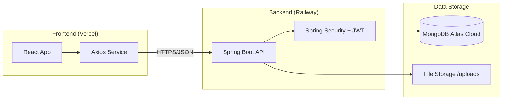

# 📊 Rapport Global - Plateforme UniGov

Ce rapport présente l'architecture technique, les outils et l'état actuel de la plateforme UniGov.

## 🏗️ Architecture Globale
UniGov suit une architecture **Découplée (Decoupled)** avec un frontend moderne communiquant via une API REST avec un backend robuste.

---

## 💻 Stack Technique

### **Frontend (Vite + React)**
*   **Framework** : React 18+ (avec Hooks et Context API pour le State Management).
*   **Styling** : Vanille CSS avec des variables modernes et des composants premium dynamiques.
*   **Icônes** : Lucide React (pour un design épuré et professionnel).
*   **Charts** : Recharts (utilisé pour l'affichage dynamique des résultats de sondages).
*   **Communication** : Axios (configuré avec des intercepteurs pour la gestion automatique des tokens JWT).

### **Backend (Spring Boot)**
*   **Langage** : Java (JDK 21/25).
*   **Core** : Spring Boot 3.x.
*   **Sécurité** : Spring Security + JWT (JSON Web Tokens) pour une authentification sans état (Stateless).
*   **Accès Données** : Spring Data MongoDB.
*   **Validation** : Bean Validation (Hibernate Validator).

### **Base de Données & Stockage**
*   **Base de Données** : MongoDB Atlas (Cluster Cloud global).
*   **Stockage de fichiers** : Système de fichiers local sur le serveur (dossier `/uploads` pour les photos de profil et pièces jointes).

---

## 🚀 Déploiement & Infrastructure

| Composant | Hébergeur | Technologie | URL |
| :--- | :--- | :--- | :--- |
| **Frontend** | **Vercel** | CI/CD automatique via GitHub | [unigovplatform.vercel.app](https://unigovplatform.vercel.app/) |
| **Backend** | **Railway** | Docker (Containerization) | [unigov-platform-production.up.railway.app](https://unigov-platform-production.up.railway.app/) |
| **Database** | **MongoDB Atlas** | DB-as-a-Service Cloud | *Privé* |

---

## 🛠️ Fonctionnalités Implémentées

1.  **Authentification** : Système multi-rôles (ADMIN, DELEGUE, STUDENT).
2.  **Annonces** : Publication d'annonces officielles avec pièces jointes (PDF/Images).
3.  **Sondages** : Création de sondages interactifs avec visualisation des résultats en temps réel.
4.  **Messagerie** : Système de communication entre étudiants et délégués.
5.  **Agenda** : Calendrier dynamique des évènements universitaires.
6.  **Réclamations** : Dépôt et suivi des plaintes avec niveaux de priorité.
7.  **Maintenance** : Outil intégré pour injecter des données de démonstration.

---

## 📈 État Actuel
*   ✅ **Backend** : Opérationnel, connecté à MongoDB Atlas, CORS configurés.
*   ✅ **Frontend** : Connecté à l'API de production, support du mode sombre/clair.
*   ✅ **Mobile** : Compatible grâce au design responsive et à l'hébergement HTTPS sécurisé.

**Dernière mise à jour** : 16 Février 2026.
